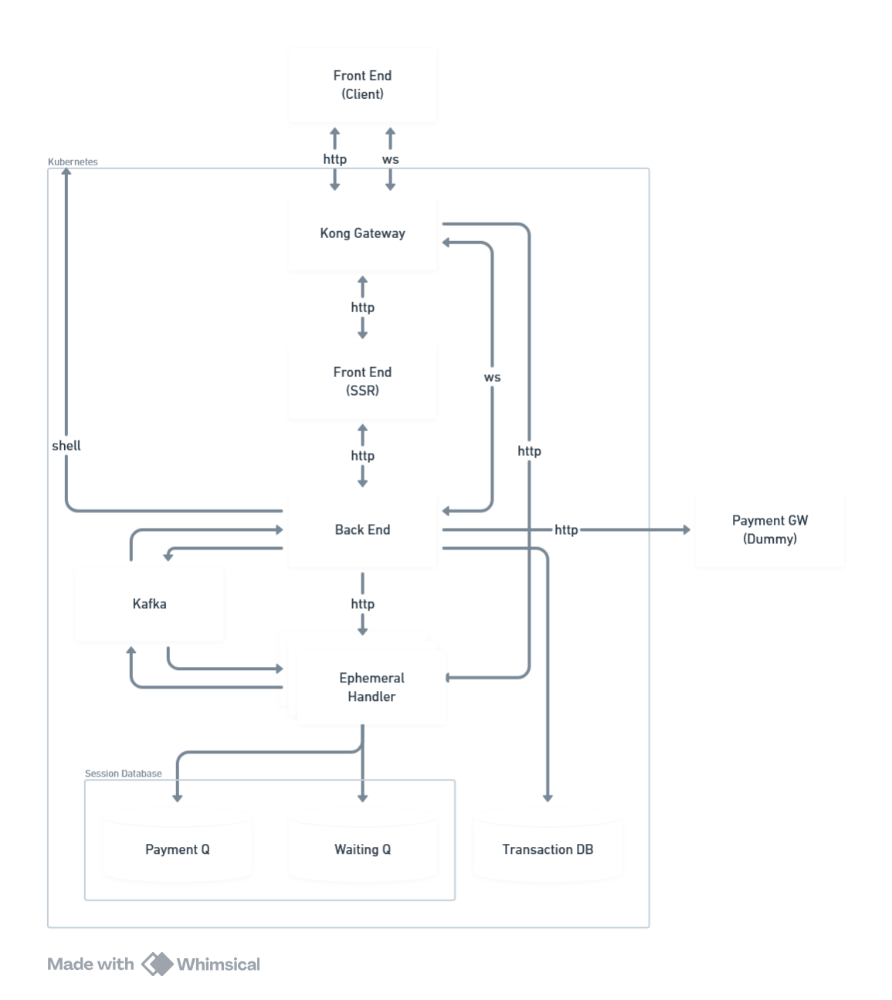

# Flash Sale POC

Minimal flash-sale system demonstrating real-time updates, queueing, and inter-service messaging.

## Architecture



- In-memory storage for demo purposes
- Single-instance Transaction service (per sale) for easy testing

## Services

- Frontend (Next.js): UI with live updates over websockets
- Backend (NestJS): REST API, Kafka consumer, and Socket.IO broadcaster
- Transaction (NestJS): Handles buy/payment queues and emits Kafka events
- Payment (NestJS, dummy): Accepts payments and calls back Transaction

## Environment

Each app provides a sample env file under `src/apps/<app>/sample.env`.
- Configure Kafka (`KAFKA_BROKERS`, `KAFKA_TOPIC`) and ports as needed
- Frontend expects `NEXT_PUBLIC_*` URLs for apps and websocket


## Run (Development)

```
pnpm --filter frontend dev
pnpm --filter backend start:dev
pnpm --filter transaction start:dev
pnpm --filter payment start:dev
```

Ensure Kafka is running and reachable by Backend and Transaction.

## APIs (summary)

- Backend
  - GET `/sales` → list sales
  - GET `/sales/:id` → sale detail
  - GET `/sales/:id/buyers` → buyers for sale
  - POST `/sales/:id/eligible` → 200 if buyer name eligible, 400 if exists

- Transaction
  - POST `/buy` `{ buyerName }` → `{ transactionId, state: "payment"|"waiting" }`
    - Rejects (400) if sale not active, sold out, or buyer already joined
  - POST `/paid` `{ transactionId }` → `{ success: true }` only if transaction is in `payment` queue; 400 otherwise

- Payment (dummy)
  - POST `/pay` `{ transactionId, quantity }` → calls back Transaction `/paid`

## Websocket Events (from Backend)

- `sale_update` `{ saleId, remainingQty, buyerName }`
- `sale_started` `{ saleId, startsAt }`
- `sale_ended` `{ saleId, endsAt }`
- `sale_event` `{ saleId, event: "start"|"end", at }`
- `queue_switch` `{ transactionId, buyerName, saleId }`

## Kafka Events

- Topic: `transactions` (configurable via `KAFKA_TOPIC`)
- Producer: Transaction service
- Consumer: Backend service

Payloads

```json
// paid
{
  "transactionId": "<ObjectId>",
  "buyerName": "<string>",
  "saleId": "<ObjectId>",
  "type": "paid"
}

// switch (waiting -> payment)
{
  "transactionId": "<ObjectId>",
  "buyerName": "<string>",
  "saleId": "<ObjectId>",
  "type": "switch"
}
```

Backend behavior
- `paid`: adds buyer to Backend buyers, decrements sale qty, emits `sale_update`
- `switch`: emits `queue_switch`

## Behavior Notes

- IDs are MongoDB ObjectId hex strings, to ensure time-based ascending order
- Transaction initializes by syncing sale and buyers from Backend
- Duplicate buyer names per sale are rejected
- When `productQty <= 0`:
  - New `/buy` requests respond 400 (sold out)
  - Waiting queue is cleared
- Stale payments (> 1 minute) are cleaned up and backfilled from waiting

## Load Testing (k6)

Scripts: see `src/tests/load-tests/k6-buy-pay.js`.

```
pnpm test:load                   # all scenarios
pnpm test:load:small|medium|large|xlarge
```

Note: In `payment` state, ~85% of virtual buyers proceed to `/pay`.

## Unit Testing

Jest unit tests are available for Backend and Transaction services.

```
# Backend tests
pnpm --filter backend test

# Transaction tests
pnpm --filter transaction test
```
